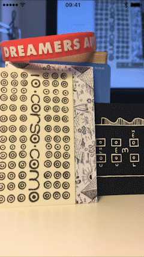

# LMCaptureVideoPreviewLayer

## Introduction

LMCaptureVideoPreviewLayer is a preview layer for the AVCaptureSession with a Metal-based blur filter. You can use it like a AVCaptureVideoPreviewLayer and then dynamically/in real-time apply a blur filter to the video output frames.

It was developed for [Lightmate](https://lightmate.app/ "Lightmate")'s iOS app with the goal of replacing AVFoundation's *AVCaptureVideoPreviewLayer*. This is mainly an R&D project and there are still many optimizations needed before it can be used in a "production" context. This is an attempt to share some of the learnings and components used in the app.

## Requirements and Dependencies

* iOS 17.0 or later
* Swift 5.9 or later
* Supported devices: any device with a Metal capable GPU
* Metal / Metal Shading Language

## Using with Swift Package Manager

Add the package to the `dependencies` of your `Package.swift`:

```swift
.package(url: "https://github.com/laugga/VisualEffectCaptureVideoPreviewLayer.git", from: "0.2.0")
```

and to the target that uses it:

```swift
.target(name: "YourTarget", dependencies: ["LMCaptureVideoPreviewLayer"])
```

In Xcode, use *File > Add Package Dependencies…* and paste the same URL.

LMCaptureVideoPreviewLayer's interface is very similar to AVCaptureVideoPreviewLayer. Here's an example:

```swift
import LMCaptureVideoPreviewLayer

// Create your AVCaptureSession
// ...

// Create the session video preview layer from LMCaptureVideoPreviewLayer
let videoPreviewLayer = LMCaptureVideoPreviewLayer(session: captureSession)
view.layer.addSublayer(videoPreviewLayer)

// Change the blur property just like you change opacity
videoPreviewLayer.blur = 1.0

// Or animate the transition to a new value
videoPreviewLayer.setBlur(0.0, animated: true)
```

The layer is a `CAMetalLayer` subclass, so its `frame` has to be kept in sync with the view that hosts it, usually from `layoutSubviews()`.

## Example

The example is a single view application with a AVCaptureSession and a AVCaptureDeviceInput (back camera).



__Interactions:__

* Tap to blur-in (animated)
* Pull-down to gradually decrease blur value
* Pause/Resume the capture session (animated)

Open `Example/LMCaptureVideoPreviewLayer.xcodeproj` and run the `Example` scheme. It opens on a catalog of scenarios; `Basics → Default` is the screen described above. The project references the package at the root of this repository, so there is nothing to install. There is no capture device on the Simulator, so the example feeds the preview layer with a generated colour grid there, and shows the real camera on a device.

## Repository layout

| Path | Contents |
| --- | --- |
| `Sources/LMCaptureVideoPreviewLayer` | The layer, the capture pipeline and the `.metal` shaders |
| `Sources/LMCaptureVideoPreviewLayerShaderTypes` | The structures shared between Swift and the shading language |
| `Tests/LMCaptureVideoPreviewLayerTests` | Rendering tests, comparing against reference images |
| `Example` | The example application |
| `Docs/matlab` | The script that generates the gaussian kernel tables |

The rendering tests compare against reference images captured at a 2x scale, so they are skipped unless they run on a device with a 2x screen, such as the iPhone SE:

```bash
xcodebuild test -scheme LMCaptureVideoPreviewLayer -destination 'platform=iOS Simulator,name=iPhone SE (3rd generation)'
```

Add `,OS=17.0` to the destination if you have that simulator installed for more than one runtime, otherwise the name is ambiguous and xcodebuild will not match it.

## Development Notes

__LMCaptureVideoPreviewLayer vs. AVCaptureVideoPreviewLayer__

LMCaptureVideoPreviewLayer could be used as a drop-in replacement for AVCaptureVideoPreviewLayer. Our intention during the development was to copy and mimic as much as possible AVCaptureVideoPreviewLayer's interface and behavior. However, under the hood that is totally different. To start AVCaptureVideoPreviewLayer is Apple's own preview layer with access to unknown APIs. If you inspect an AVCaptureSession's connections you'll notice AVCaptureVideoPreviewLayer is used as an output (just like AVCaptureVideoDataOutput, for example).

In order to make LMCaptureVideoPreviewLayer work we need to add a AVCaptureVideoDataOutput to the existing AVCaptureSession. We then use the `captureOutput(_:didOutput:from:)` delegate method to render each frame and apply the blur filter. If you need to use a AVCaptureVideoDataOutput yourself it's also possible. In that case LMCaptureVideoPreviewLayer will detect if an existing AVCaptureVideoDataOutput is already added to the session's outputs and then _hijack_ it. Your `captureOutput(_:didOutput:from:)` delegate method will then be called from LMCaptureVideoPreviewLayer.

Only the part of the AVCaptureVideoPreviewLayer interface that is actually implemented is exposed: `init(session:)`, `session`, `blur`, `setBlur(_:animated:)` and `videoGravity`. The coordinate conversion helpers are not implemented.

Remember, LMCaptureVideoPreviewLayer is experimental. Please report any issues you find.

__Rendering__

Each frame goes through the same pipeline:

1. The sample buffer's pixel buffer is wrapped in a `MTLTexture` through a `CVMetalTextureCache`, with no copy.
2. It is downsampled by a factor of 4 into the first of two offscreen render targets.
3. The separable gaussian is applied by ping-ponging between the two render targets, twice in each direction.
4. The result is drawn into the layer drawable, aspect-filled and rotated 90 degrees by the quad texture coordinates.

When the blur is 0 no filtering happens at all: an `AVCaptureVideoPreviewLayer` sublayer is shown instead, which is cheaper on both the CPU and the GPU, and the display link is paused.

__Gaussian Blur Implementation__

1. Separable filters
2. Bilinear interpolated texture sampling
3. Downsampling
4. Dynamic texture lookup

The kernels are not computed at runtime. `Docs/matlab/LMCaptureVideoPreviewLayer.m` generates eleven kernels, one per blur step between 0 and 1, and the weights and offsets are kept in `LMCaptureVideoPreviewLayerGaussianFilterKernel.swift`. Animating the blur walks through them.

## References

[Real-Time Rendering, 3rd Edition, 10.9 Image Processing (p.468-472)](http://www.realtimerendering.com)

[Intel, An investigation of fast real-time GPU-based image blur algorithms](https://software.intel.com/en-us/blogs/2014/07/15/an-investigation-of-fast-real-time-gpu-based-image-blur-algorithms)

[GPU Gems 3, Chapter 40. Incremental Computation of the Gaussian](http://http.developer.nvidia.com/GPUGems3/gpugems3_ch40.html)

[Rastergrid, Efficient Gaussian blur with linear sampling](http://rastergrid.com/blog/2010/09/efficient-gaussian-blur-with-linear-sampling/)

[Xissburg, Faster Gaussian Blur in GLSL](http://xissburg.com/faster-gaussian-blur-in-glsl/)
